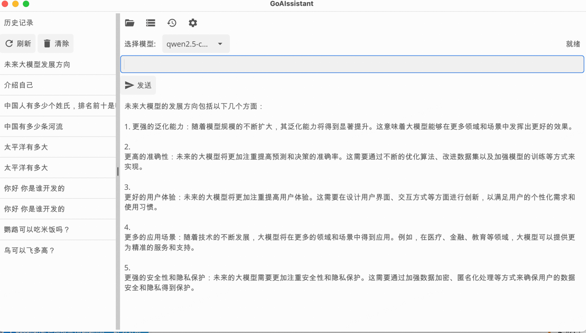

## golang 桌面AI Desk 使用 fyne 构建



## ollama安装方法
安装ollama：
`
curl -sSL https://ollama.com/install.sh | sudo bash
`

使用ollama安装大模型 比如 deepseek或者qwen
`
ollama pull deepseek
ollama pull qwen
`
模型需要带上具体的模型名，比如：
`
ollama run deepseek-1r:3b
ollama run qwen:7b
`

## 以下是 ChromaDB 的本地安装和部署方法：
https://docs.trychroma.com/docs/overview/introduction
#### 使用 Chroma CLI 安装
安装 Python：确保安装了 Python 3.8 到 3.11 版本。

安装 ChromaDB：
`
pip install chromadb
`

运行 Chroma 服务：
`
chroma run --host localhost --port 8000 --path ./chroma_data
`
--host：指定监听的主机，默认为 localhost。
--port：指定监听的端口，默认为 8000。
--path：指定本地存储 Chroma 数据的路径。

#### 使用 Docker 安装
安装 Docker：确保已安装 Docker。

运行 Chroma 服务：
```
docker run -d --rm --name chromadb -p 8000:8000
 -v ./chroma:/chroma/chroma 
 -e IS_PERSISTENT=TRUE 
 -e ANONYMIZED_TELEMETRY=TRUE 
 chromadb/chroma:0.6.3
```
-p 8000:8000：指定 Chroma 服务暴露的端口。
-v：指定本地存储 Chroma 数据的目录。
-e IS_PERSISTENT=TRUE：启用数据持久化。
-e ANONYMIZED_TELEMETRY=TRUE：启用匿名产品遥测功能。

#### 使用 Docker Compose 安装
安装 Docker 和 Git：确保已安装 Docker 和 Git。

克隆 Chroma 仓库：
```
git clone https://github.com/chroma-core/chroma && cd chroma
```

运行 Chroma 服务：
```
docker compose up -d --build
```


